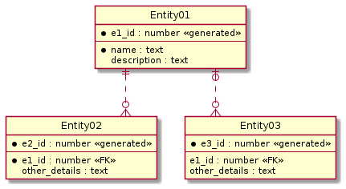

# PlantUMLの作図環境のサンプル

## サーバ起動方法

```
$ docker run -d -p 8080:8080 plantuml/plantuml-server:jetty
```

## サーバ停止方法

```
$ docker stop <container name>
```

## 実行例

* er_diagram.pu



## Reference

* [plantuml/plantuml-server](https://hub.docker.com/r/plantuml/plantuml-server)
* [How to use !include with PlantUML Server](https://forum.plantuml.net/8767/how-to-use-include-with-plantuml-server)
* [ER図](https://plantuml.com/ja/ie-diagram)
