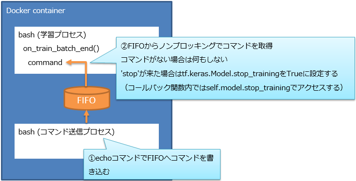

# TensorFlow(Keras)の学習を任意のタイミングで停止する

[keras.models.Model.fit](https://keras.io/ja/models/model/#fit)で学習を開始するとEarlyStoppingもしくは指定EPOCH数の学習を終えるまで返ってこない．  
コマンドラインではCtrl+Cで強制終了することも可能だが，強制終了すると当然ながらfit()以降の処理も停止する．

そこで，任意のタイミングでfit()関数から抜ける仕組みをFIFOを介して実現する方法を紹介する．

## 実装方法概要



## Reference

* [Callbackを利用して、Tensorflowのトレーニングを停止する](https://pizi.netlify.app/posts/using-callback-function-to-stop-training/)

## 参考：実行ログ(例)

カスタムコールバック中のon_train_batch_end()内でFIFOからstopコマンドを検出すると```End batch: recv command=stop```を表示して学習を終了する．

```
root@7f75defb2064:/work/11_terminate# ./run.sh
/work/11_terminate
[Training Conditions]
  * MODEL_TYPE=SimpleCNN
  * DATA_TYPE=CIFAR-10
  * DATA_AUG=5,0.2,0.2,0.2,0.2,True
  * DATA_AUG_NAME=DA-5
  * OPTIMIZER=momentum
  * BATCH_SIZE=100
  * INITIALIZER=he_normal
  * DATA_NORM=max
  * DROPOUT_RATE=0.25
  * LOSS_FUNC=categorical_crossentropy
  * EPOCHS=400
2022-01-02 06:28:45.974644: I tensorflow/stream_executor/platform/default/dso_loader.cc:49] Successfully opened dynamic library libcudart.so.11.0
2022-01-02 06:28:47.761385: I tensorflow/compiler/jit/xla_cpu_device.cc:41] Not creating XLA devices, tf_xla_enable_xla_devices not set
2022-01-02 06:28:47.762843: I tensorflow/stream_executor/platform/default/dso_loader.cc:49] Successfully opened dynamic library libcuda.so.1
2022-01-02 06:28:47.799804: E tensorflow/stream_executor/cuda/cuda_gpu_executor.cc:1024] could not open file to read NUMA node: /sys/bus/pci/devices/0000:01:00.0/numa_node
Your kernel may have been built without NUMA support.
2022-01-02 06:28:47.799917: I tensorflow/core/common_runtime/gpu/gpu_device.cc:1746] Found device 0 with properties:
pciBusID: 0000:01:00.0 name: NVIDIA GeForce RTX 2070 SUPER computeCapability: 7.5
coreClock: 1.785GHz coreCount: 40 deviceMemorySize: 8.00GiB deviceMemoryBandwidth: 417.29GiB/s
2022-01-02 06:28:47.800007: I tensorflow/stream_executor/platform/default/dso_loader.cc:49] Successfully opened dynamic library libcudart.so.11.0
2022-01-02 06:28:47.804425: I tensorflow/stream_executor/platform/default/dso_loader.cc:49] Successfully opened dynamic library libcublas.so.11
2022-01-02 06:28:47.804571: I tensorflow/stream_executor/platform/default/dso_loader.cc:49] Successfully opened dynamic library libcublasLt.so.11
2022-01-02 06:28:47.805425: I tensorflow/stream_executor/platform/default/dso_loader.cc:49] Successfully opened dynamic library libcufft.so.10
2022-01-02 06:28:47.805810: I tensorflow/stream_executor/platform/default/dso_loader.cc:49] Successfully opened dynamic library libcurand.so.10
2022-01-02 06:28:47.806739: I tensorflow/stream_executor/platform/default/dso_loader.cc:49] Successfully opened dynamic library libcusolver.so.11
2022-01-02 06:28:47.807508: I tensorflow/stream_executor/platform/default/dso_loader.cc:49] Successfully opened dynamic library libcusparse.so.11
2022-01-02 06:28:47.807724: I tensorflow/stream_executor/platform/default/dso_loader.cc:49] Successfully opened dynamic library libcudnn.so.8
2022-01-02 06:28:47.808300: E tensorflow/stream_executor/cuda/cuda_gpu_executor.cc:1024] could not open file to read NUMA node: /sys/bus/pci/devices/0000:01:00.0/numa_node
Your kernel may have been built without NUMA support.
2022-01-02 06:28:47.808711: E tensorflow/stream_executor/cuda/cuda_gpu_executor.cc:1024] could not open file to read NUMA node: /sys/bus/pci/devices/0000:01:00.0/numa_node
Your kernel may have been built without NUMA support.
2022-01-02 06:28:47.808761: I tensorflow/core/common_runtime/gpu/gpu_device.cc:1888] Adding visible gpu devices: 0
2022-01-02 06:28:47.815906: I tensorflow/compiler/jit/xla_gpu_device.cc:99] Not creating XLA devices, tf_xla_enable_xla_devices not set
2022-01-02 06:28:47.816672: E tensorflow/stream_executor/cuda/cuda_gpu_executor.cc:1024] could not open file to read NUMA node: /sys/bus/pci/devices/0000:01:00.0/numa_node
Your kernel may have been built without NUMA support.
2022-01-02 06:28:47.816762: I tensorflow/core/common_runtime/gpu/gpu_device.cc:1746] Found device 0 with properties:
pciBusID: 0000:01:00.0 name: NVIDIA GeForce RTX 2070 SUPER computeCapability: 7.5
coreClock: 1.785GHz coreCount: 40 deviceMemorySize: 8.00GiB deviceMemoryBandwidth: 417.29GiB/s
2022-01-02 06:28:47.816836: I tensorflow/stream_executor/platform/default/dso_loader.cc:49] Successfully opened dynamic library libcudart.so.11.0
2022-01-02 06:28:47.816887: I tensorflow/stream_executor/platform/default/dso_loader.cc:49] Successfully opened dynamic library libcublas.so.11
2022-01-02 06:28:47.816909: I tensorflow/stream_executor/platform/default/dso_loader.cc:49] Successfully opened dynamic library libcublasLt.so.11
2022-01-02 06:28:47.816937: I tensorflow/stream_executor/platform/default/dso_loader.cc:49] Successfully opened dynamic library libcufft.so.10
2022-01-02 06:28:47.816965: I tensorflow/stream_executor/platform/default/dso_loader.cc:49] Successfully opened dynamic library libcurand.so.10
2022-01-02 06:28:47.816981: I tensorflow/stream_executor/platform/default/dso_loader.cc:49] Successfully opened dynamic library libcusolver.so.11
2022-01-02 06:28:47.816999: I tensorflow/stream_executor/platform/default/dso_loader.cc:49] Successfully opened dynamic library libcusparse.so.11
2022-01-02 06:28:47.817017: I tensorflow/stream_executor/platform/default/dso_loader.cc:49] Successfully opened dynamic library libcudnn.so.8
2022-01-02 06:28:47.817437: E tensorflow/stream_executor/cuda/cuda_gpu_executor.cc:1024] could not open file to read NUMA node: /sys/bus/pci/devices/0000:01:00.0/numa_node
Your kernel may have been built without NUMA support.
2022-01-02 06:28:47.817824: E tensorflow/stream_executor/cuda/cuda_gpu_executor.cc:1024] could not open file to read NUMA node: /sys/bus/pci/devices/0000:01:00.0/numa_node
Your kernel may have been built without NUMA support.
2022-01-02 06:28:47.817873: I tensorflow/core/common_runtime/gpu/gpu_device.cc:1888] Adding visible gpu devices: 0
2022-01-02 06:28:47.818270: I tensorflow/stream_executor/platform/default/dso_loader.cc:49] Successfully opened dynamic library libcudart.so.11.0
2022-01-02 06:28:48.347377: I tensorflow/core/common_runtime/gpu/gpu_device.cc:1287] Device interconnect StreamExecutor with strength 1 edge matrix:
2022-01-02 06:28:48.347452: I tensorflow/core/common_runtime/gpu/gpu_device.cc:1293]      0
2022-01-02 06:28:48.347463: I tensorflow/core/common_runtime/gpu/gpu_device.cc:1306] 0:   N
2022-01-02 06:28:48.348214: E tensorflow/stream_executor/cuda/cuda_gpu_executor.cc:1024] could not open file to read NUMA node: /sys/bus/pci/devices/0000:01:00.0/numa_node
Your kernel may have been built without NUMA support.
2022-01-02 06:28:48.348636: E tensorflow/stream_executor/cuda/cuda_gpu_executor.cc:1024] could not open file to read NUMA node: /sys/bus/pci/devices/0000:01:00.0/numa_node
Your kernel may have been built without NUMA support.
2022-01-02 06:28:48.348676: I tensorflow/core/common_runtime/gpu/gpu_device.cc:1515] Could not identify NUMA node of platform GPU id 0, defaulting to 0.  Your kernel may not have been built with NUMA support.
2022-01-02 06:28:48.349045: E tensorflow/stream_executor/cuda/cuda_gpu_executor.cc:1024] could not open file to read NUMA node: /sys/bus/pci/devices/0000:01:00.0/numa_node
Your kernel may have been built without NUMA support.
2022-01-02 06:28:48.349113: I tensorflow/core/common_runtime/gpu/gpu_device.cc:1432] Created TensorFlow device (/job:localhost/replica:0/task:0/device:GPU:0 with 5958 MB memory) -> physical GPU (device: 0, name: NVIDIA GeForce RTX 2070 SUPER, pci bus id: 0000:01:00.0, compute capability: 7.5)
2022-01-02 06:28:48.905582: I tensorflow/core/profiler/lib/profiler_session.cc:136] Profiler session initializing.
2022-01-02 06:28:48.905636: I tensorflow/core/profiler/lib/profiler_session.cc:155] Profiler session started.
2022-01-02 06:28:48.905673: I tensorflow/core/profiler/internal/gpu/cupti_tracer.cc:1365] Profiler found 1 GPUs
2022-01-02 06:28:48.906564: I tensorflow/stream_executor/platform/default/dso_loader.cc:49] Successfully opened dynamic library libcupti.so.11.2
2022-01-02 06:28:48.912495: E tensorflow/core/profiler/internal/gpu/cupti_tracer.cc:1415] function cupti_interface_->Subscribe( &subscriber_, (CUpti_CallbackFunc)ApiCallback, this)failed with error CUPTI_ERROR_NOT_INITIALIZED
2022-01-02 06:28:48.912575: W tensorflow/core/profiler/lib/profiler_session.cc:165] Encountered error while starting profiler: Unavailable: CUPTI cannot be enabled. Another profile session might be running.
2022-01-02 06:28:48.912628: I tensorflow/core/profiler/lib/profiler_session.cc:172] Profiler session tear down.
2022-01-02 06:28:49.375914: I tensorflow/compiler/mlir/mlir_graph_optimization_pass.cc:116] None of the MLIR optimization passes are enabled (registered 2)
2022-01-02 06:28:49.376313: I tensorflow/core/platform/profile_utils/cpu_utils.cc:112] CPU Frequency: 2903995000 Hz
2022-01-02 06:28:49.701746: I tensorflow/stream_executor/platform/default/dso_loader.cc:49] Successfully opened dynamic library libcublas.so.11
2022-01-02 06:28:50.065695: I tensorflow/stream_executor/platform/default/dso_loader.cc:49] Successfully opened dynamic library libcublasLt.so.11
2022-01-02 06:28:50.068290: I tensorflow/stream_executor/platform/default/dso_loader.cc:49] Successfully opened dynamic library libcudnn.so.8
2022-01-02 06:28:51.443540: I tensorflow/core/profiler/lib/profiler_session.cc:136] Profiler session initializing.
2022-01-02 06:28:51.443593: I tensorflow/core/profiler/lib/profiler_session.cc:155] Profiler session started.
2022-01-02 06:28:51.450845: E tensorflow/core/profiler/internal/gpu/cupti_tracer.cc:1415] function cupti_interface_->Subscribe( &subscriber_, (CUpti_CallbackFunc)ApiCallback, this)failed with error CUPTI_ERROR_NOT_INITIALIZED
2022-01-02 06:28:51.450914: W tensorflow/core/profiler/lib/profiler_session.cc:165] Encountered error while starting profiler: Unavailable: CUPTI cannot be enabled. Another profile session might be running.
2022-01-02 06:28:51.634640: I tensorflow/core/profiler/lib/profiler_session.cc:71] Profiler session collecting data.
2022-01-02 06:28:51.635889: E tensorflow/core/profiler/internal/gpu/device_tracer.cc:211] Cannot collect, profiler failed to start
2022-01-02 06:28:51.636311: I tensorflow/core/profiler/lib/profiler_session.cc:172] Profiler session tear down.
2022-01-02 06:28:51.644387: I tensorflow/core/profiler/rpc/client/save_profile.cc:137] Creating directory: ./output_cifar10/model/SimpleCNN_CIFAR-10_DA-5_OPT-momentum_batch100_he_normal_datanorm-max_dropout-0.25_categorical_crossentropy_epochs400/logs/train/plugins/profile/2022_01_02_06_28_51
2022-01-02 06:28:51.648650: I tensorflow/core/profiler/rpc/client/save_profile.cc:143] Dumped gzipped tool data for trace.json.gz to ./output_cifar10/model/SimpleCNN_CIFAR-10_DA-5_OPT-momentum_batch100_he_normal_datanorm-max_dropout-0.25_categorical_crossentropy_epochs400/logs/train/plugins/profile/2022_01_02_06_28_51/7f75defb2064.trace.json.gz
2022-01-02 06:28:51.659012: I tensorflow/core/profiler/rpc/client/save_profile.cc:137] Creating directory: ./output_cifar10/model/SimpleCNN_CIFAR-10_DA-5_OPT-momentum_batch100_he_normal_datanorm-max_dropout-0.25_categorical_crossentropy_epochs400/logs/train/plugins/profile/2022_01_02_06_28_51
2022-01-02 06:28:51.665173: I tensorflow/core/profiler/rpc/client/save_profile.cc:143] Dumped gzipped tool data for memory_profile.json.gz to ./output_cifar10/model/SimpleCNN_CIFAR-10_DA-5_OPT-momentum_batch100_he_normal_datanorm-max_dropout-0.25_categorical_crossentropy_epochs400/logs/train/plugins/profile/2022_01_02_06_28_51/7f75defb2064.memory_profile.json.gz
2022-01-02 06:28:51.687761: I tensorflow/core/profiler/rpc/client/capture_profile.cc:251] Creating directory: ./output_cifar10/model/SimpleCNN_CIFAR-10_DA-5_OPT-momentum_batch100_he_normal_datanorm-max_dropout-0.25_categorical_crossentropy_epochs400/logs/train/plugins/profile/2022_01_02_06_28_51Dumped tool data for xplane.pb to ./output_cifar10/model/SimpleCNN_CIFAR-10_DA-5_OPT-momentum_batch100_he_normal_datanorm-max_dropout-0.25_categorical_crossentropy_epochs400/logs/train/plugins/profile/2022_01_02_06_28_51/7f75defb2064.xplane.pb
Dumped tool data for overview_page.pb to ./output_cifar10/model/SimpleCNN_CIFAR-10_DA-5_OPT-momentum_batch100_he_normal_datanorm-max_dropout-0.25_categorical_crossentropy_epochs400/logs/train/plugins/profile/2022_01_02_06_28_51/7f75defb2064.overview_page.pb
Dumped tool data for input_pipeline.pb to ./output_cifar10/model/SimpleCNN_CIFAR-10_DA-5_OPT-momentum_batch100_he_normal_datanorm-max_dropout-0.25_categorical_crossentropy_epochs400/logs/train/plugins/profile/2022_01_02_06_28_51/7f75defb2064.input_pipeline.pb
Dumped tool data for tensorflow_stats.pb to ./output_cifar10/model/SimpleCNN_CIFAR-10_DA-5_OPT-momentum_batch100_he_normal_datanorm-max_dropout-0.25_categorical_crossentropy_epochs400/logs/train/plugins/profile/2022_01_02_06_28_51/7f75defb2064.tensorflow_stats.pb
Dumped tool data for kernel_stats.pb to ./output_cifar10/model/SimpleCNN_CIFAR-10_DA-5_OPT-momentum_batch100_he_normal_datanorm-max_dropout-0.25_categorical_crossentropy_epochs400/logs/train/plugins/profile/2022_01_02_06_28_51/7f75defb2064.kernel_stats.pb

[INFO] Arguments
  * args.fifo = /tmp/fifo_trainer_ctl
  * args.data_type = CIFAR-10
  * args.dataset_dir = ./dataset/cifar-10-batches-py
  * args.model_type = SimpleCNN
  * args.data_augmentation = 5,0.2,0.2,0.2,0.2,True
  * args.optimizer = momentum
  * args.batch_size = 100
  * args.initializer = he_normal
  * args.data_norm = max
  * args.dropout_rate = 0.25
  * args.loss_func = categorical_crossentropy
  * args.epochs = 400
  * args.result_dir = ./output_cifar10/model/SimpleCNN_CIFAR-10_DA-5_OPT-momentum_batch100_he_normal_datanorm-max_dropout-0.25_categorical_crossentropy_epochs400
(40000, 32, 32, 3)
(40000, 10)
(10000, 32, 32, 3)
(10000, 10)
(10000, 32, 32, 3)
(10000, 10)
Model: "sequential"
_________________________________________________________________
Layer (type)                 Output Shape              Param #
=================================================================
conv2d (Conv2D)              (None, 30, 30, 32)        896
_________________________________________________________________
max_pooling2d (MaxPooling2D) (None, 15, 15, 32)        0
_________________________________________________________________
conv2d_1 (Conv2D)            (None, 13, 13, 64)        18496
_________________________________________________________________
max_pooling2d_1 (MaxPooling2 (None, 6, 6, 64)          0
_________________________________________________________________
conv2d_2 (Conv2D)            (None, 4, 4, 64)          36928
_________________________________________________________________
max_pooling2d_2 (MaxPooling2 (None, 2, 2, 64)          0
_________________________________________________________________
flatten (Flatten)            (None, 256)               0
_________________________________________________________________
dense (Dense)                (None, 64)                16448
_________________________________________________________________
dense_1 (Dense)              (None, 10)                650
=================================================================
Total params: 73,418
Trainable params: 73,418
Non-trainable params: 0
_________________________________________________________________
End batch: recv unknown command=test

Epoch 00001: saving model to ./output_cifar10/model/SimpleCNN_CIFAR-10_DA-5_OPT-momentum_batch100_he_normal_datanorm-max_dropout-0.25_categorical_crossentropy_epochs400/checkpoints/model.ckpt
End epoch 0: (loss = 2.185659646987915), (accuracy = 0.1835249960422516), (val_loss = 1.8927663564682007), (val_accuracy = 0.2840000092983246)
End batch: recv command=stop

Epoch 00002: saving model to ./output_cifar10/model/SimpleCNN_CIFAR-10_DA-5_OPT-momentum_batch100_he_normal_datanorm-max_dropout-0.25_categorical_crossentropy_epochs400/checkpoints/model.ckpt
End epoch 1: (loss = 1.9323668479919434), (accuracy = 0.2800000011920929), (val_loss = 1.9142595529556274), (val_accuracy = 0.28060001134872437)
313/313 - 1s - loss: 1.8921 - accuracy: 0.2836
2022-01-02 06:29:14.525146: W tensorflow/python/util/util.cc:348] Sets are not currently considered sequences, but this may change in the future, so consider avoiding using them.
Test Accuracy: 0.28360000252723694
Test Loss: 1.8921222686767578

Predictions(shape): (10000, 10)
root@7f75defb2064:/work/11_terminate#

```

