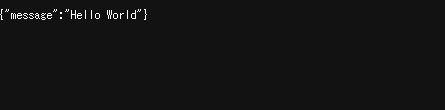

# Web App Environment Sample (nginx + react + Python + FastAPI)

## Overview

This is a sample project to demonstrate how to build a web application environment using nginx, React, Python, and FastAPI.

## Architecture

The architecture of this project is as follows:

```
+-------------------+    +-------------------+
|                   |    |                   |
|  React (Frontend) |    |  FastAPI (Backend) |
|                   |    |                   |
+-------------------+    +-------------------+
           |                        |
           |                        |
           |                        |
           +------------------------+
                      |
                      |
                      |
           +------------------------+
           |                        |
           |       nginx (Web Server)|
           |                        |
           +------------------------+
                      |
                      |
                      |
           +------------------------+
           |                        |
           |       Docker (Container)|
           |                        |
           +------------------------+
```

## Build

```bash
docker-compose build
docker-compose run --rm frontend sh -c "npm install -g create-react-app && create-react-app react-project --template typescript"
```

## Run

```bash
docker-compose up
```

## Access

- Frontend: http://localhost


- Backend(api): http://localhost/api



```
nginx_1     | 172.31.0.1 - - [13/Jul/2024:06:33:38 +0000] "GET /api HTTP/1.1" 200 25 "-" "Mozilla/5.0 (Windows NT 10.0; Win64; x64) AppleWebKit/537.36 (KHTML, like Gecko) Chrome/126.0.0.0 Safari/537.36" "-"
backend_1   | Headers({'host': 'localhost', 'x-forwarded-for': '172.31.0.1', 'x-forwarded-host': 'localhost', 'x-forwarded-server': 'localhost', 'x-real-ip': '172.31.0.1', 'x-forwarded-proto': 'http', 'connection': 'close', 'cache-control': 'max-age=0', 'sec-ch-ua': '"Not/A)Brand";v="8", "Chromium";v="126", "Google Chrome";v="126"', 'sec-ch-ua-mobile': '?0', 'sec-ch-ua-platform': '"Windows"', 'upgrade-insecure-requests': '1', 'user-agent': 'Mozilla/5.0 (Windows NT 10.0; Win64; x64) AppleWebKit/537.36 (KHTML, like Gecko) Chrome/126.0.0.0 Safari/537.36', 'accept': 'text/html,application/xhtml+xml,application/xml;q=0.9,image/avif,image/webp,image/apng,*/*;q=0.8,application/signed-exchange;v=b3;q=0.7', 'sec-fetch-site': 'none', 'sec-fetch-mode': 'navigate', 'sec-fetch-user': '?1', 'sec-fetch-dest': 'document', 'accept-encoding': 'gzip, deflate, br, zstd', 'accept-language': 'ja-JP,ja;q=0.9,en-US;q=0.8,en;q=0.7'})  
backend_1   | INFO:     172.31.0.2:46396 - "GET /api HTTP/1.0" 200 OK
```

- Backend(no-proxy-header): http://localhost/no-proxy-header


```
backend_1   | Headers({'host': 'backend:4000', 'connection': 'close', 'sec-ch-ua': '"Not/A)Brand";v="8", "Chromium";v="126", "Google Chrome";v="126"', 'sec-ch-ua-mobile': '?0', 'sec-ch-ua-platform': '"Windows"', 'upgrade-insecure-requests': '1', 'user-agent': 'Mozilla/5.0 (Windows NT 10.0; Win64; x64) AppleWebKit/537.36 (KHTML, like Gecko) Chrome/126.0.0.0 Safari/537.36', 'sec-purpose': 'prefetch;prerender', 'purpose': 'prefetch', 'accept': 'text/html,application/xhtml+xml,application/xml;q=0.9,image/avif,image/webp,image/apng,*/*;q=0.8,application/signed-exchange;v=b3;q=0.7', 'sec-fetch-site': 'none', 'sec-fetch-mode': 'navigate', 'sec-fetch-user': '?1', 'sec-fetch-dest': 'document', 'accept-encoding': 'gzip, deflate, br, zstd', 'accept-language': 'ja-JP,ja;q=0.9,en-US;q=0.8,en;q=0.7'})
backend_1   | INFO:     172.31.0.2:54724 - "GET /no-proxy-header HTTP/1.0" 200 OK
```
